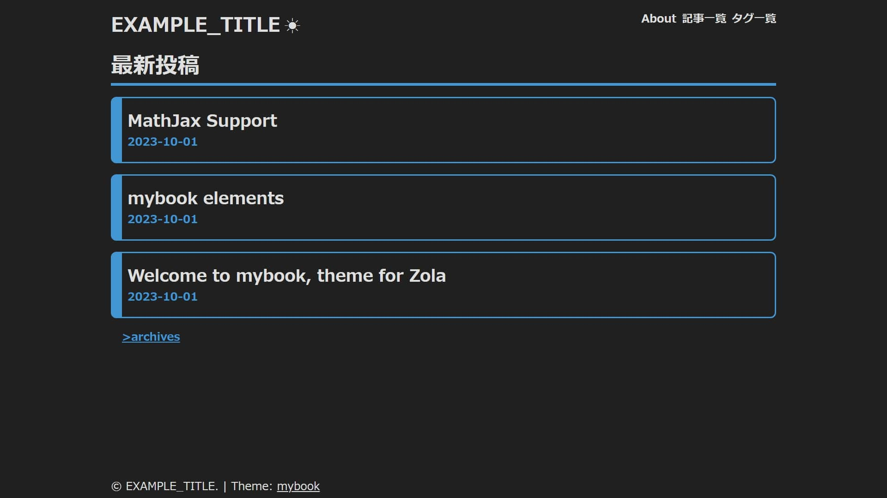

# myBook - Zola theme
mybookは、個人ブログ向けのZolaテーマです。

## Demo
[mybook-demo.pages.dev](https://mybook-demo.pages.dev/)


## ✨Features
- dark & light theme.
- mobile friendly.
- MathJax support.

## 🧮MathJax support

MathJax を使用するには、`.md` ファイルに次のように記述します。
```
+++
[extra]
math = true
+++
```

## 🛠カスタマイズ

### Config
`config.toml`の`[extra]`で以下の設定が可能です。

#### home_display_posts
トップページに表示される最新投稿順で表示される記事数を指定します。

### Accent color
デフォルトでは青系のカラーが設定されています。これを変更するには、`.static/css/style.css`の`--ACCENT_COLOR`を変更してください。

### Favicon
Faviconは`/static`下に`favicon.ico`を設置してください。

## version
### v0.0.1-a.1 / 2023-10-12
- UIを魔改造

### v0.0.1-a.2 / 2023-10-13
- スタイル強化
- 前後記事送り機能を追加
- テーマ切り替え機能を追加
- ポストカードのタイトルを3行で省略

### v0.0.1-a.3 / 2023-10-14
- ポイントブロックの追加
- リンクカードの追加
- 画像埋め込みに対応
- カテゴリとタグがない場合にmetaが非表示にならない問題を修正。
- 動画埋め込み対応
- サイト名にサイト名が適応されない問題を修正
- ヘッダーメニューの項目名が長い場合にスタイルが崩れる問題を暫定修正
- メンテナンス性を向上
- テーマを目に優しい色合いに調整
- 文字の誤植を修正

### v0.0.1 / 2023-10-17
- ポストカードのスタイル崩れを修正
- ポストカードのスタイルを変更
- リンクカードのスタイルを変更
- インラインイメージ要素を追加

### v0.0.2 / 2023-10-18
- スペースブロックを追加

### Futures
- PWA対応
- 音声埋め込み対応
- SNSフォローボタン追加
- 動画埋め込み(iframe)

## Thanks
### emily
[https://github.com/kyoheiu/emily_zola_theme](https://github.com/kyoheiu/emily_zola_theme)

### Zola入門
[https://brainvader.github.io/brain-space/blog/2019/05/post-038/](https://brainvader.github.io/brain-space/blog/2019/05/post-038/)